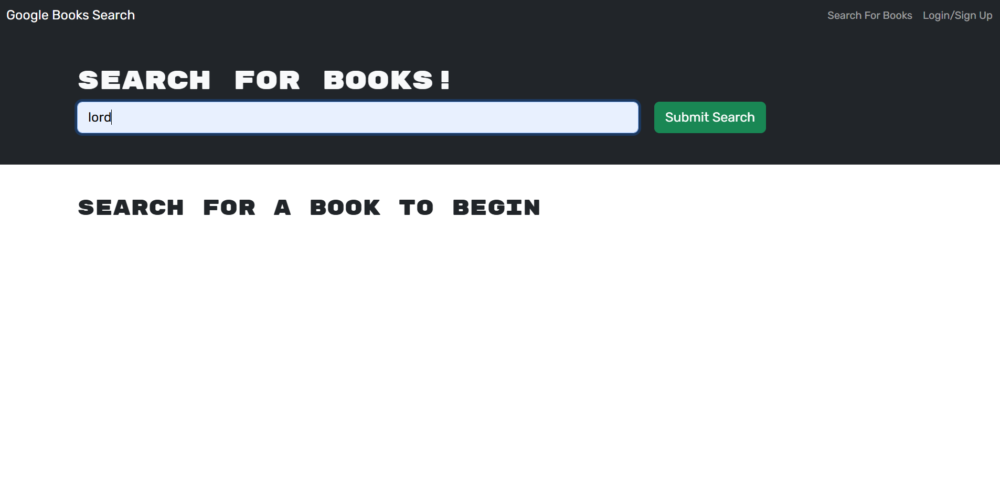

# Mandobooks

## Basic Overview

Mandobooks is a Google Books API search engine which was initially built with a RESTful API, then refactored into a GraphQL API built with Apollo Server. 
The app was built using the MERN stack, with a React front end, MongoDB database, and Node.js/Express.js server and API. 

## The Application

The application was setted up as an Apollo Server to use GraphQL queries and mutations to fetch and modify data, replacing the existing RESTful API.deployed on Render to host the application.
 The application was created then modified using the following tools: 

    type: MERN stack
    API: GraphQL
    Server: Apollo Server
    Deployment: Render

## Deployment

The application was deployed to Render.com.

[Link here](https://mandobooks.onrender.com)

    
## Screenshot
The following images demonstrates the application's appearance:

Home Page

Search Results

Login Page

## Contribution
No monetay contribution but will always accept critics and improvement options 

## Future Development
For future development, the serverAPI will but used in another project (Undetermined). 

##
Note: I received help from BCS Learning assistant (to clarify my errors) and tutors. 

© 2024 lenworth425 Confidential and Proprietary. All Rights Reserved.